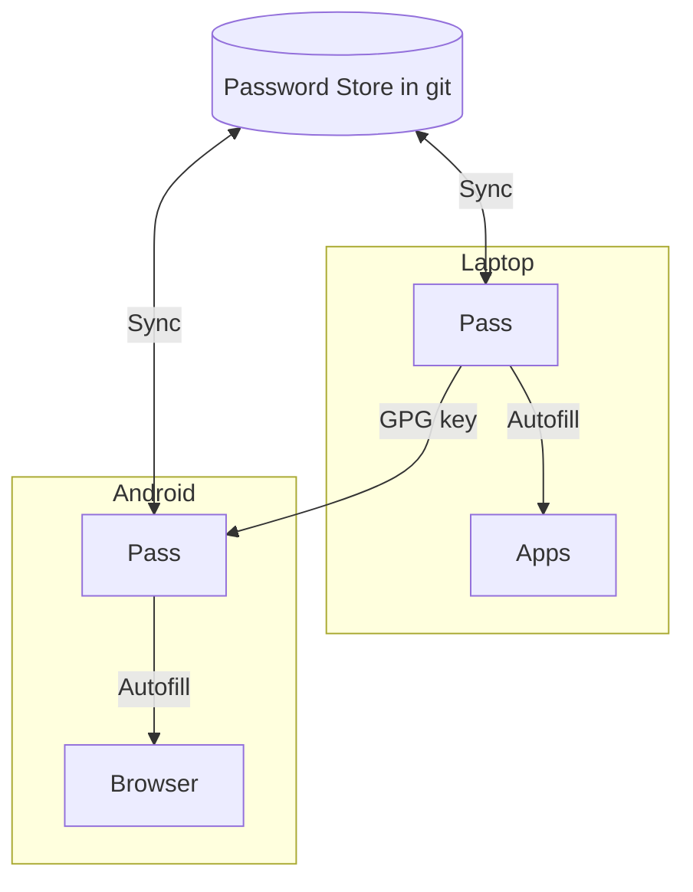

I started to take password management more seriously lately.

Reusing passwords is bad. Storing them in notes is worse. Depending on an external 
service always puts you in a walled garden and that is never good.

I want the password store to be **mine**, portable, simple and boring.

That is why `pass` its perfect:

* Passwords are just GPG encrypted files
* Stored in a git repo
* Works on laptop and phone perfectly so far
* No servers, no accounts, no subscriptions!

## The idea

The idea is very simple:

1. There is a single password store
2. It lives in a git repository
3. All devices clone and sync that repo (yes, automatically, wait for a sec)
4. The same GPG key is used everywhere
5. Apps and browsers use pass for autofill

## How it works

At a high level the flow looks like this:



The laptop is usually the place where the store is created and managed but you do you.
The phone syncs and consumes it, you can always use tmux to setup everything in the phone of course.

## 1. Access your phone via SSH

On Android your best bet is to use [Termux](https://play.google.com/store/apps/details?id=com.termux&pli=1).

On the phone:

```shell
pkg update
pkg install openssh sshd passwd
```

Start sshd and check the IP:

```shell
sshd
hostname -I
```

On the laptop:

```shell
ssh u0_a482@PHONE_IP -p 8022
```

Once this works you can treat the phone almost like a normal machine.

## 2. Git access from the phone

The phone needs SSH access to your git host.

On the phone:

```shell
ssh-keygen -t ed25519 -f ~/.ssh/id_ed25519 -N ""
cat ~/.ssh/id_ed25519.pub
```

Add that public key to your Git provider (GitHub, GitLab, etc).

Test it:

```shell
ssh -T git@github.com
```

Then clone the password store:

```shell
git clone git@github.com:username/password-store.git ~/password-store
```

## 3. Import the GPG key

The same GPG key must exist on all devices.

On the laptop:

```shell
gpg --export-secret-keys --armor YOUR_KEY_ID > key.asc
scp -P 8022 key.asc u0_a482@PHONE_IP:~
```

On the phone:

```shell
gpg --import ~/key.asc
```

If you use an Android app like **OpenKeychain**, also import `key.asc` there.

## 4. Enable Autofill on Android

Go to:

> Android Settings -> Passwords & Accounts -> Autofill service

Select **Password Store** and grant the permissions it asks for.

After this, browsers and apps can request credentials from pass.

## 5. Entry naming matters

Autofill matching is based on entry names.

Use domains as paths:

```
github.com/marcel
amazon.com/personal
mybank.co.uk/login
```

Avoid generic names without domains, those usually don't match.

## Final result

You end up with:

* One encrypted password store
* Synced with git
* Works offline
* No third-party services
* Autofill on laptop and Android

It is not flashy, but it is reliable, transparent and fully under your control.


