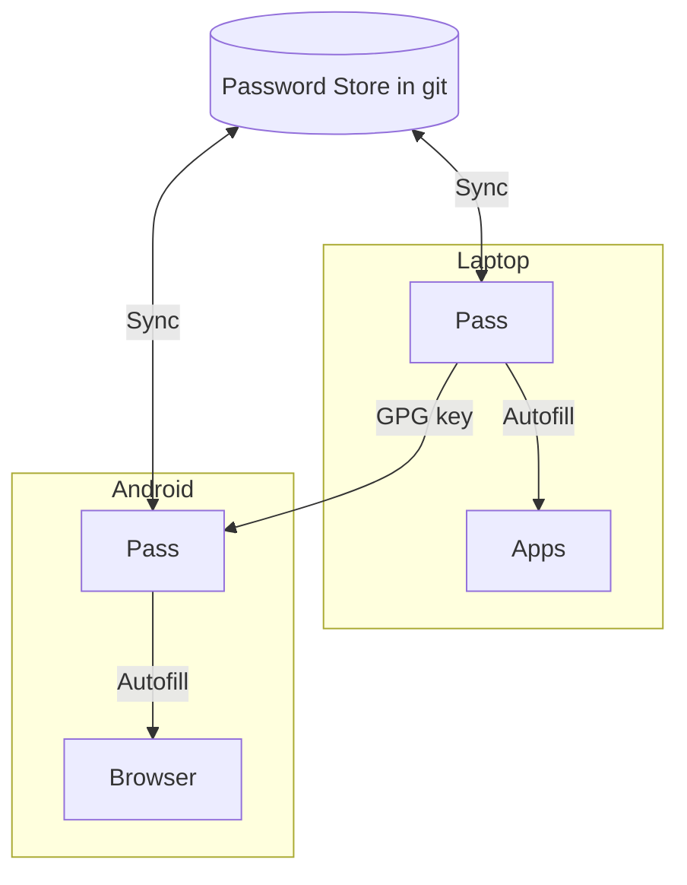

I’ve been using password managers more seriously lately. Re-using passwords and
storing them in notes is a liability. I also don’t want to depend on password
services. I want the vault to be _mine_, portable and simple.

`pass` gives you exactly that: GPG-encrypted files in
a Git repo you control.

# The flow



## 1. SSH into your phone

On the phone (Termux):

```shell
pkg update pkg install openssh sshd passwd hostname -I
```

On the laptop:

```shell
ssh u0_a482@PHONE_IP -p 8022
```

## 2. Add Git SSH auth to the phone

On the phone (Termux):

```shell
ssh-keygen -t ed25519 -f ~/.ssh/id_ed25519 -N "" cat ~/.ssh/id_ed25519.pub
ssh -T git@github.com
git clone git@github.com:username/password-store.git ~/password-store
```

Add the printed `.pub` key to your Git host (account SSH keys).

## 3. Import your GPG key

On the laptop:

```
gpg --export-secret-keys --armor YOUR_KEY_ID > key.asc
scp -P 8022 key.asc
u0_a482@PHONE_IP:~
```

On the phone (Termux):

```
gpg --import ~/key.asc
```

Also import `key.asc` in **OpenKeychain** if your Android app uses it.

## 4. Enable Autofill

Android Settings -> Passwords & accounts -> Autofill service -> Password Store

Grant the requested permissions.

## 5. Name entries by domain for autofill matching

Use the site domain in the path:

```
github.com/marcel amazon.com/personal mybank.co.uk/login
```

Avoid names without domains — they won’t match.

You now have a self-hosted, encrypted password store that syncs to Android
securely over SSH and autofills in your browser, without external password
services.
